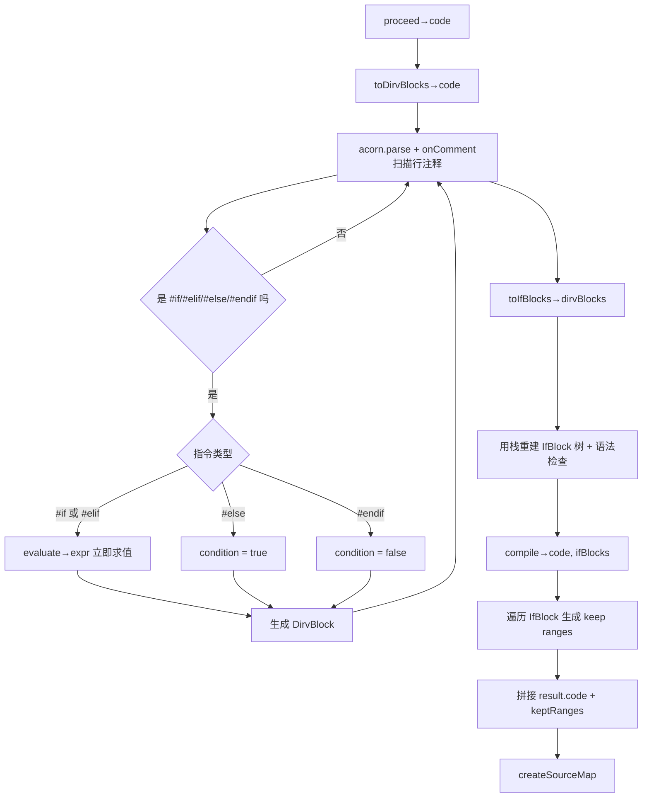
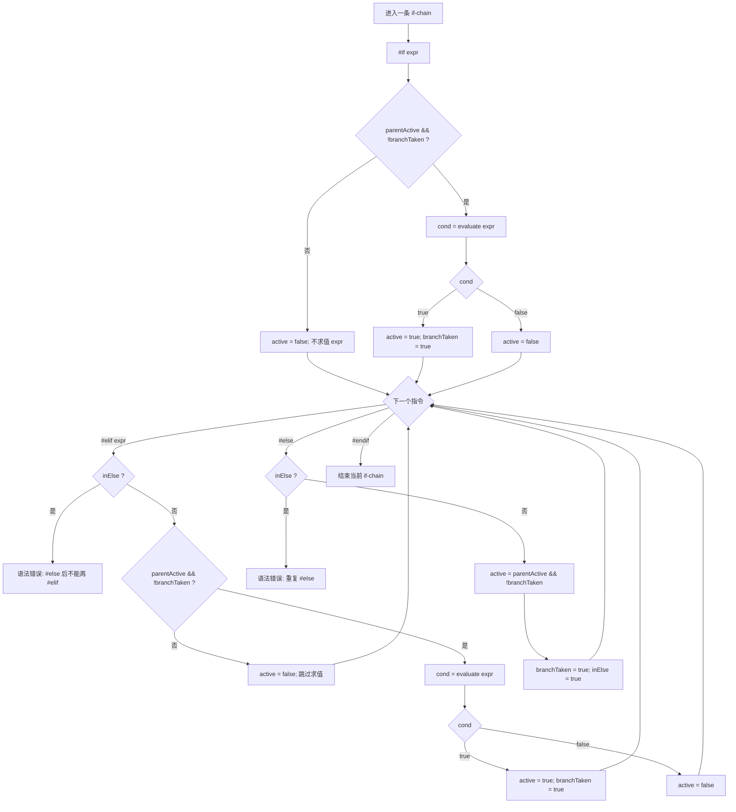

# 条件编译 `if` 判定流程图

下面用两张 Mermaid 图说明：

1. 现在代码里的实际流程（`parser.ts` 现状）
2. 更符合直觉的“有记忆短路”流程（建议模型）

---

## 1) 当前实现流程（现状）



### 这个流程的关键特点

- `#if/#elif` 在 **收集注释阶段** 就会 `evaluate`。
- 所以某个 `#elif` 即便在逻辑上已不可达，也可能被提前求值。
- 这就是你说的“看起来无记忆”的来源：
  - 收集阶段没有 `branchTaken`（该链是否已命中）这个状态。

---

## 2) 建议的“有记忆短路”流程（状态机）

核心状态：

- `parentActive`: 父层是否可达
- `branchTaken`: 当前 `if/elif/else` 链是否已有命中分支
- `inElse`: 是否已经进入过 `#else`



---

## 3) 一个最小例子（帮助理解“短路记忆”）

```js
// #if true
keepA();
// #elif UNKNOWN_VAR
keepB();
// #else
keepC();
// #endif
```

在“有记忆短路”模型里：

- `#if true` 命中后，`branchTaken = true`
- 后续 `#elif UNKNOWN_VAR` **不会求值**（直接跳过）
- `#else` 也不会激活
- 最终只保留 `keepA()`

---

## 4) 一句话总结

- 你现在的实现是“先求值、后建树”，因此在 `elif` 上看起来“无记忆”。
- 若改成“状态机驱动求值”，就会变成“按链短路、有记忆”的判定流程。
